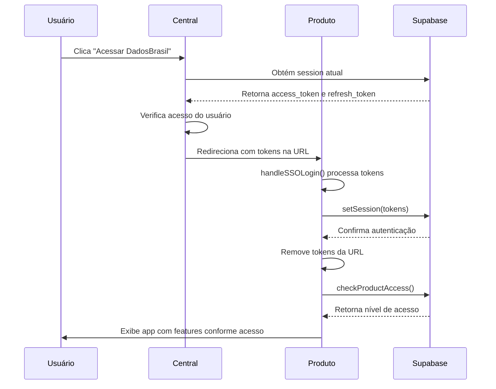

# Guia de Implementação SSO para Produtos

## Para Desenvolvedores de Produtos em Subdomínios

Este guia explica como implementar o receptor SSO em cada produto separado para permitir autenticação automática via Central.

---

## 🎯 Objetivo

Permitir que usuários autenticados na Central sejam automaticamente autenticados nos produtos sem precisar fazer login novamente.

---

## 📋 Pré-requisitos

1. ✅ Produto criado como projeto separado no Lovable
2. ✅ Supabase configurado (usando o mesmo projeto da Central)
3. ✅ Domínio configurado (ex: `dadosbrasil.cienciadedados.org`)

---

## 🔧 Implementação

### Passo 1: Criar Utilitário SSO

Crie o arquivo `src/utils/ssoAuth.ts` no projeto do produto:

```typescript
import { supabase } from "@/integrations/supabase/client";

/**
 * Processa autenticação SSO a partir de tokens na URL
 * Deve ser chamado na inicialização do app
 */
export const handleSSOLogin = async (): Promise<boolean> => {
  try {
    // Obtém parâmetros da URL
    const urlParams = new URLSearchParams(window.location.search);
    const accessToken = urlParams.get('access_token');
    const refreshToken = urlParams.get('refresh_token');

    // Se não há tokens, verifica se já está autenticado
    if (!accessToken || !refreshToken) {
      const { data: { session } } = await supabase.auth.getSession();
      return !!session;
    }

    // Define sessão com os tokens recebidos
    const { error } = await supabase.auth.setSession({
      access_token: accessToken,
      refresh_token: refreshToken,
    });

    if (error) {
      console.error("Erro ao autenticar via SSO:", error);
      return false;
    }

    // Remove tokens da URL (por segurança)
    const cleanUrl = window.location.pathname;
    window.history.replaceState({}, document.title, cleanUrl);

    console.log("SSO: Autenticação bem-sucedida");
    return true;

  } catch (error) {
    console.error("Erro no processo SSO:", error);
    return false;
  }
};

/**
 * Redireciona para a Central se não estiver autenticado
 */
export const redirectToLoginIfNeeded = async (): Promise<void> => {
  const isAuthenticated = await handleSSOLogin();
  
  if (!isAuthenticated) {
    // Redireciona para Central com return URL
    const returnUrl = encodeURIComponent(window.location.href);
    window.location.href = `https://www.cienciadedados.org/auth?return=${returnUrl}`;
  }
};
```

### Passo 2: Integrar no App Principal

Edite `src/App.tsx` (ou componente principal):

```typescript
import { useEffect, useState } from "react";
import { handleSSOLogin, redirectToLoginIfNeeded } from "@/utils/ssoAuth";
import { useAuth } from "@/hooks/useAuth"; // Se existir

function App() {
  const [isAuthenticating, setIsAuthenticating] = useState(true);

  useEffect(() => {
    const initAuth = async () => {
      // Tenta autenticar via SSO
      await handleSSOLogin();
      setIsAuthenticating(false);
    };

    initAuth();
  }, []);

  // Mostra loading enquanto autentica
  if (isAuthenticating) {
    return (
      <div className="min-h-screen flex items-center justify-center">
        <div className="text-center">
          <div className="animate-spin rounded-full h-12 w-12 border-b-2 border-primary mx-auto mb-4"></div>
          <p className="text-muted-foreground">Autenticando...</p>
        </div>
      </div>
    );
  }

  return (
    // Seu app aqui
    <div className="app">
      {/* ... */}
    </div>
  );
}

export default App;
```

### Passo 3: Proteger Rotas (Opcional)

Se quiser proteger rotas específicas:

```typescript
import { Navigate } from "react-router-dom";
import { useAuth } from "@/hooks/useAuth";

const ProtectedRoute = ({ children }: { children: React.ReactNode }) => {
  const { user, loading } = useAuth();

  if (loading) {
    return <div>Carregando...</div>;
  }

  if (!user) {
    // Redireciona para Central
    const returnUrl = encodeURIComponent(window.location.href);
    window.location.href = `https://www.cienciadedados.org/auth?return=${returnUrl}`;
    return null;
  }

  return <>{children}</>;
};

// Uso em rotas
<Route 
  path="/dashboard" 
  element={
    <ProtectedRoute>
      <Dashboard />
    </ProtectedRoute>
  } 
/>
```

---

## 🧪 Testando

### Teste Local

1. **Na Central (localhost):**
   ```
   http://localhost:8080
   ```
   - Faça login
   - Clique em "Acessar" em um produto

2. **No Produto (localhost do produto):**
   - Deve autenticar automaticamente
   - Verifique console: "SSO: Autenticação bem-sucedida"

### Teste em Produção

1. **Central:**
   ```
   https://www.cienciadedados.org
   ```
   - Faça login
   - Clique em "Acessar DadosBrasil"

2. **Produto:**
   ```
   https://dadosbrasil.cienciadedados.org
   ```
   - Deve carregar autenticado
   - Não deve ver tokens na URL após autenticação

---

## 🔒 Segurança

### Boas Práticas Implementadas

1. ✅ **Tokens removidos da URL**: Após autenticação, tokens são removidos do histórico
2. ✅ **HTTPS obrigatório**: Tokens só trafegam via HTTPS em produção
3. ✅ **Tokens de curta duração**: Access tokens do Supabase expiram em 1h
4. ✅ **Refresh automático**: Supabase gerencia refresh de tokens automaticamente

### O que NÃO fazer

❌ Armazenar tokens em localStorage manualmente
❌ Passar tokens via POST ou formulários
❌ Logar tokens no console em produção
❌ Usar a mesma sessão para múltiplos usuários

---

## 🐛 Troubleshooting

### Problema: "Erro ao autenticar via SSO"

**Possíveis causas:**
- Tokens inválidos ou expirados
- Configuração Supabase incorreta
- CORS bloqueando requisição

**Solução:**
1. Verifique se está usando o mesmo projeto Supabase
2. Confirme que `VITE_SUPABASE_URL` e `VITE_SUPABASE_PUBLISHABLE_KEY` estão corretos
3. Teste gerando novo token na Central

### Problema: Redirecionamento em loop

**Causa:** Produto tenta redirecionar para Central que redireciona de volta

**Solução:**
```typescript
// Adicione flag para prevenir loops
const hasAttemptedSSO = sessionStorage.getItem('sso_attempted');

if (!isAuthenticated && !hasAttemptedSSO) {
  sessionStorage.setItem('sso_attempted', 'true');
  redirectToLoginIfNeeded();
}
```

### Problema: Usuário não tem acesso ao produto

**Causa:** Falta registro na tabela `product_access`

**Solução:**
```sql
-- No Supabase SQL Editor
INSERT INTO product_access (user_id, product_id, access_type, is_active)
VALUES (
  'uuid-do-usuario',
  (SELECT id FROM products WHERE slug = 'dadosbrasil'),
  'limited',
  true
);
```

---

## 🎫 Modelo de Acesso

O acesso é baseado em **assinaturas por produto**, não em roles globais.

### Tipos de Acesso

| Nível | Condição | Acesso |
|-------|----------|--------|
| **Gratuito** | Usuário autenticado sem assinatura | Básico (free tier) em todos os produtos |
| **Limitado** | Assinatura ativa em 1+ produtos | Completo nos assinados, básico nos demais |
| **Ilimitado** | Assinatura em TODOS os produtos | Completo em todos (condição calculada) |

### Verificação de Acesso no Produto

Use a função `check_product_access` para verificar o nível de acesso:

```typescript
import { supabase } from "@/integrations/supabase/client";

async function checkUserAccess(productSlug: string) {
  const { data: { user } } = await supabase.auth.getUser();
  
  if (!user) {
    return { hasAccess: false, level: 'none' };
  }
  
  const { data } = await supabase.rpc('check_product_access', {
    _user_id: user.id,
    _product_slug: productSlug
  });
  
  const access = data?.[0];
  return {
    hasAccess: access?.has_access ?? false,
    level: access?.access_level ?? 'gratuito',
    usageLimit: access?.usage_limit,
    usageCount: access?.usage_count
  };
}
```

---

## 📊 Checklist de Implementação

### Setup Inicial
- [ ] Arquivo `src/utils/ssoAuth.ts` criado
- [ ] `handleSSOLogin` integrado no `App.tsx`
- [ ] Loading state implementado
- [ ] Supabase client configurado corretamente
- [ ] Verificação de acesso implementada

### Testes
- [ ] Login via Central funciona
- [ ] Tokens removidos da URL após auth
- [ ] Refresh de página mantém autenticação
- [ ] Logout na Central desloga do produto
- [ ] Níveis de acesso funcionam corretamente

### Produção
- [ ] HTTPS configurado e funcionando
- [ ] SSL válido no subdomínio
- [ ] Logs de debug removidos
- [ ] Error handling implementado

---

## 🔗 Fluxo Completo



---

## 📚 Referências

- [Supabase Auth](https://supabase.com/docs/guides/auth)
- [Modelo de Acesso](./ACCESS-MODEL.md) - Documentação completa do modelo
- [React Router Protected Routes](https://reactrouter.com/en/main/start/tutorial#protected-routes)

---

**Última atualização**: 2026-02-01
**Versão**: 2.0
